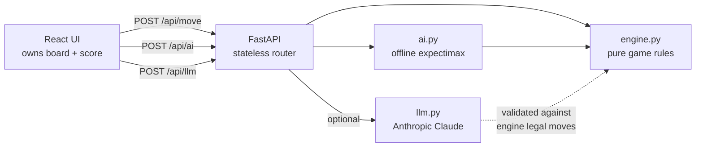

# 2048 Home Exercise

A small, from-scratch implementation of the [2048](https://play2048.co) game.

It has two parts:

- **`backend/`** — a Python game engine, two move advisers (an offline
  **expectimax AI** and an optional remote **LLM**), and a **stateless**
  FastAPI HTTP API.
- **`frontend/`** — a Vite + React + TypeScript single-page app (the UI).

The backend owns the game rules; the frontend keeps the board and score in
client state and calls the API for each move.

## Table of contents

- [Quick start](#quick-start)
- [Additional configuration](#additional-configuration)
- [Exercise requirements](#exercise-requirements)
- [Architecture](#architecture)
- [API](#api)
- [AI move suggestion](#ai-move-suggestion)
- [Further development](#further-development)

## Quick start

Run the backend and the frontend in two terminals. You need
[uv](https://docs.astral.sh/uv/) (Python `>=3.13`) and
[Node.js](https://nodejs.org/) (18+).

```bash
# terminal 1 — backend API at http://localhost:8000
cd backend
uv sync                                                    # install deps into .venv
uv run --env-file ../.env uvicorn game2048.main:app --reload
```

```bash
# terminal 2 — frontend at http://localhost:5173
cd frontend
npm install
npm run dev
```

Open <http://localhost:5173> and play with the arrow keys (or W A S D). The Vite
dev server proxies `/api/*` to the backend, so no extra configuration is needed.
Interactive API docs are available at <http://localhost:8000/docs>.

### Optional: remote LLM adviser

The offline **Ask AI** adviser needs no configuration. To also enable the **Ask
Claude** button, provide an [Anthropic](https://console.anthropic.com) API key
via a git-ignored `.env` file at the repo root (or in `backend/`):

```bash
# .env
ANTHROPIC_API_KEY=sk-ant-your-key-here
```

The key is read from the environment at request time; the backend command above
loads it via `--env-file` (VS Code's integrated terminal also loads it
automatically — see `.vscode/settings.json`). Without a key the rest of the app
works fine and only **Ask Claude** is unavailable.

**Important:**
> `--env-file` requires the file to exist. If you are not using **Ask Claude**,
> either create an empty `.env` at the repo root or drop the
> `--env-file ../.env` flag.

## Additional configuration

Game and AI parameters live in
[backend/src/game2048/config.py](backend/src/game2048/config.py):

- **Game:** board size, initial tile count range, odds of spawning a `4`, and
  the winning value.
- **AI:** search depth, win/loss rewards, and the heuristic weights.
- **LLM:** the Anthropic model name (`LLM_MODEL`). The API key itself is **not**
  stored here — it is read from the `ANTHROPIC_API_KEY` environment variable
  (see [Optional: remote LLM adviser](#optional-remote-llm-adviser)).

## Exercise requirements

These are the original exercise requirements the project satisfies. Where
they conflict with the classic 2048 game, **these requirements win**.

1. **Initial board.** Generate a starting board with a *random number* of `2`s
   placed at random cells.
2. **Move Left.** Slide tiles left, merging equal adjacent tiles.
3. **Move Right.** Slide tiles right, merging equal adjacent tiles.
4. **Move Up / Move Down.** Same merge behaviour on columns.
5. **Spawn after a move.** Add a `2` or `4` at a random empty cell **only after
   a valid move that changes the board**.
6. **Endgame.** Detect **Win** (a tile reaches `2048`) and **Lose** (no empty
   cells and no valid moves remain).
7. **AI suggestion.** During play, let the player ask an AI for the best next
   move to avoid game over and maximise the chance of winning. Two advisers are
   provided:
   - an **offline** depth-limited expectimax search;
     see [AI move suggestion](#ai-move-suggestion), and
   - a **remote LLM** (Anthropic Claude) behind an **Ask Claude** button.
     The API key lives in a git-ignored `.env` file (see [Optional: remote LLM adviser](#optional-remote-llm-adviser)).

Where the exercise leaves a choice open, the project assumes:

- The board is a square grid (default 4×4, configurable in `config.py`).
- Empty cells are represented as `None` in Python and `null` in JSON.
- A spawned tile is a `2` 90% of the time and a `4` the other 10%.

## Architecture

The API is **stateless** — the React UI owns the board and score and sends the
full board with every request, while the backend stays a thin wrapper over the
pure, side-effect-free engine. The UI handles rendering, keyboard controls
(arrows or W A S D), the live score, start/reset, and win/lose feedback. Both
advisers defer to the engine as the single source of truth: the LLM's answer is
re-validated against the engine's legal moves before it is returned.



```text
home-exercise-2048/
├── backend/
│   ├── src/game2048/
│   │   ├── config.py     # tunable game + AI parameters (incl. LLM model)
│   │   ├── engine.py     # pure domain logic (move functions + helpers)
│   │   ├── ai.py         # offline expectimax AI move adviser
│   │   ├── llm.py         # optional remote LLM (Claude) move adviser
│   │   ├── utils.py      # shared direction -> move-function mapping
│   │   ├── api.py        # FastAPI router: /api/new, /api/move, /api/ai, /api/llm
│   │   └── main.py       # FastAPI app: CORS, router wiring, /health
│   ├── tests/            # test_engine.py, test_api.py, test_ai.py,
│   │                     # test_llm.py, test_utils.py
│   └── pyproject.toml
├── frontend/
│   ├── src/
│   │   ├── api.ts                # typed fetch client for the backend
│   │   ├── hooks/useGame.ts      # game state + keyboard controls
│   │   ├── components/           # Board, Tile, Scoreboard, Button
│   │   └── App.tsx               # composes the UI
│   └── package.json
├── .env
├── AGENTS.md
└── README.md
```

## API

All routes are mounted under `/api`; every request carries the full board, and
the server keeps no game state between requests.

- `POST /api/new` → `{ "board": Board }`
- `POST /api/move` with
  `{ "board": Board, "direction": "left" | "right" | "up" | "down" }`
  → `{ "board", "score_gained", "changed", "win", "game_over" }`
- `POST /api/ai` with `{ "board": Board }` → `{ "direction": Direction }`
  (offline expectimax)
- `POST /api/llm` with `{ "board": Board }` → `{ "direction": Direction }`
  (remote LLM)
- `GET /health` → `{ "status": "ok" }`

A `Board` is a 4×4 array of cells, where a cell is an integer tile or `null` for
an empty cell. A new tile spawns only when a move changes the board. An invalid
`direction` is rejected with HTTP **422** (Pydantic validation). A request to
`POST /api/ai` or `POST /api/llm` for a board with no legal moves is rejected
with HTTP **409** (the game is over, so there is no move to suggest).
`POST /api/llm` additionally returns HTTP **502** when the remote model is
unavailable or returns an unusable answer (an illegal or malformed move).

## AI move suggestion

The AI lives in [backend/src/game2048/ai.py](backend/src/game2048/ai.py) and runs
fully **offline** — it only calls the pure engine functions and makes no network
requests. It is the **default** adviser (the **Ask AI** button). An **optional**
remote LLM adviser is also provided (the **Ask Claude** button); see
[Optional LLM adviser](#optional-llm-adviser) below.

### Why expectimax

2048 is a single-player game **against chance**, not against an adversary: after
each move the game spawns a tile at a *random* empty cell (a `2` with 90%
probability, a `4` with 10%). Minimax would model that spawn as a worst-case
enemy and play far too pessimistically. **Expectimax** instead replaces the
opponent's "min" layer with a **chance** layer that averages over the possible
spawns, weighted by their probability — which matches how the game actually
behaves.

### Why expectimax is the default (not the LLM)

The offline expectimax is the **primary** adviser; the LLM is an optional extra.
A general-purpose large language model is not the best tool for the *core* of
this problem:

- **It is the simplest thing that fits.** The required adviser can run
  **offline**, with no API key, no network
  call, and no extra dependencies. A hosted model (Claude, ChatGPT, etc.) means
  a network round-trip plus a secret to manage (in a git-ignored `.env`).
- **2048 is exact search, not language.** The game has clear rules, a small
  branching factor, and a well-defined value to optimise. A few-millisecond
  expectimax search plays this near-optimally; an LLM only *approximates*
  reasoning over the board and is slower and less reliable.
- **No probabilistic guarantees.** Expectimax provably weighs the random spawns
  by their true probabilities. An LLM has no such guarantee — it can hallucinate
  illegal moves or miss a forced loss (which is why the `/api/llm` endpoint
  re-validates the model's answer against the legal moves).
- **Cost, latency, and determinism.** The local search is free, instant, and
  deterministic (so it is easy to unit-test). A remote model adds latency, cost,
  and non-determinism.

The **Ask Claude** button exists to demonstrate how a remote model *can* be
integrated safely (server-side key, validated output) — see
[Optional LLM adviser](#optional-llm-adviser). For a small, well-specified 4×4
search problem, the classic algorithm is faster, cheaper, verifiable, and
offline by construction.

### Alternative algorithms

Expectimax was chosen as the best fit, but several other approaches could solve
2048. The main trade-offs:

| Approach | Idea | Pros | Cons |
| --- | --- | --- | --- |
| **Expectimax** *(used here)* | Full tree over moves + weighted-average chance nodes | Models the random spawn exactly; strong with a good heuristic; deterministic and testable | Branching explodes as the board empties; depth must stay small |
| **Greedy / 1-ply heuristic** | Pick the move with the best immediate heuristic | Trivial and instant | Short-sighted; walks into avoidable dead ends |
| **Minimax (+ alpha-beta)** | Treat the spawn as an adversary | Alpha-beta pruning is efficient | *Wrong model* — the spawn is random, not hostile, so it plays too defensively |
| **Monte Carlo Tree Search (MCTS)** | Many random playouts, build a search tree from the results | No hand-tuned heuristic needed; scales to deep lookahead; anytime (stop whenever) | Needs many simulations for stable moves; noisier; more code than expectimax |
| **Reinforcement learning (e.g. DQN)** | Train a network to map board → best move | Very strong once trained; fast at inference | Heavy training pipeline; needs data/compute; a black box that is hard to test |

For a 4×4 board with a known spawn distribution, **expectimax hits the sweet
spot**: it exploits the exact probabilities, stays fully offline and
deterministic, and is small enough to read and unit-test. MCTS is the most
natural alternative if the heuristic ever becomes a bottleneck or the board
grows; RL is overkill for the scope of this exercise.

### How it works

The search alternates two kinds of nodes down to a fixed depth:

- **Max nodes** ("the player's turn") try every legal move and keep the best
  resulting value.
- **Chance nodes** ("the game spawns a tile") enumerate every empty cell ×
  {`2`, `4`} outcome and take the probability-weighted average.

Leaves are reached when the depth limit is hit or the board is terminal. A won
board returns a large positive reward and a lost board a large negative penalty,
so the AI strongly steers toward wins and away from losses. Non-terminal leaves
are scored by a heuristic.

### Heuristic

A non-terminal board is scored as a weighted sum of features that keep a
position healthy:

- **Empty cells** — more open space means more flexibility.
- **Potential merges** — adjacent equal tiles that could combine.
- **Max tile** (log-scaled) — progress toward `2048`.
- **Max tile in a corner** — the proven 2048 strategy of pinning the big tile.
- **Monotonicity** — rows/columns that increase or decrease consistently.
- **Smoothness** — small differences between neighbours, so tiles can merge.

All weights are tunable in
[config.py](backend/src/game2048/config.py).

The AI is exposed over the API as `POST /api/ai` and wired into the UI via the
**Ask AI** button, which shows a "Thinking" overlay while the search runs and
then the suggested move. Repeated requests for the same board are served from a
small client-side cache, so they return instantly without another network call.

### Optional LLM adviser

The optional LLM adviser lives in
[backend/src/game2048/llm.py](backend/src/game2048/llm.py) and powers the **Ask
Claude** button. It is a self-contained alternative to the offline AI and is
only reachable when an `ANTHROPIC_API_KEY` is configured (see
[Optional: remote LLM adviser](#optional-remote-llm-adviser)).

How a request flows through `POST /api/llm`:

1. The backend computes the **legal moves** for the board. If there are none,
   it returns **409** without calling the model.
2. It sends the model a system prompt (the game rules and a move-selection
   strategy) plus the board and the legal moves as JSON, asking for a single
   move back as `{ "direction": "<one of the legal moves>" }`.
3. It parses the reply and **re-validates** the returned direction against the
   legal moves. Anything unusable — a network failure, malformed JSON, or an
   illegal move — raises an error surfaced to the client as **502**.

This keeps the integration safe by construction: the API key never leaves the
server, and the engine (not the model) has the final say on what counts as a
legal move. The model and request parameters are configured in
[config.py](backend/src/game2048/config.py) (`LLM_MODEL`). Like the offline AI,
the UI caches answers per board so repeat asks are instant. The two advisers are
independent: you can ask one, dismiss it, ask the other, and switch back freely.

  (see [Optional: remote LLM adviser](#optional-remote-llm-adviser)).

## Further development

### Backend (run from `backend/`)

```bash
uv run pytest            # all tests
uv run pytest -v         # verbose
uv run ruff check .      # lint
uv run ruff format .     # format
```

### Frontend (run from `frontend/`)

```bash
npm run dev           # dev server (proxies /api -> :8000)
npm run build         # type-check (tsc) + production build
npm run lint          # ESLint (code quality)
npm run format        # Prettier — write
npm run format:check  # Prettier — verify only
```
